# Depin 参与方式

[在线地址(更新中)](https://github.com/TreeNewKing/airdropSearch/tree/master/depin)

 [项目指南](Depin赛道：Gradient，grass等六大挂机挖矿项目操作教程——chiroukyc(1).pdf) 

[ads浏览器下载](https://share.adspower.net/kf7wG3)

[来源](https://x.com/Pow2wer/status/1854816004502905019)

1. 基于API的自动化程序。逆向项目，通过直接请求API来模拟人的行为。这种方案是最节约资源与人力成本的，但是并不好维护，因为项目一旦升级或变动，方案就要改动。并且行为模式太过于单一，很容易被检测。
2. 基于浏览器的自动化程序。这种方案一般是基于selenium框架对chrome浏览器做一些自动化的工作，模拟人的行为。但是很多脚本逻辑过于简单，对于每个浏览器profile的生命周期维护做的不到位。我觉得是个好的方向，但是要做好并且维护好，对开发者有较高要求
3. 指纹浏览器。这种方案其实是用多开浏览器来隔离IP。每个浏览器的profile都有独一无二的特征，并且生命周期管理完善。需要人工，也可以开发自动化的脚本。最大缺点是贵。另外整体不够稳定，我体验过程中发现浏览器开多了经常失去响应，导致所有的浏览器都崩溃。但不得不说，这是最适合小白的方案。
4. 基于物理机/虚拟机的群控方案，手机模拟器也算这类。用机器隔离IP和应用，每个机器配一个代理，一个机器跑多个项目，真人辅以自动化脚本进行操作。这是我觉得比较安全，并且稳定的方案，但这个方案需要比较多的苦力。

# Gradient

测试账号

账号:treenewking@gmail.com

密码:gradientrobin123!

 ##  挖矿助手

[Gradient挖矿助手.zip](gradient\Gradient挖矿助手.zip) 

[来源](https://www.youtube.com/watch?v=nvH0IkWQ9z4)

[使用教程](https://www.youtube.com/watch?v=nvH0IkWQ9z4)

### 卡密: 

0E3M0C5W3W4C9L6Z

### 运行效果: 

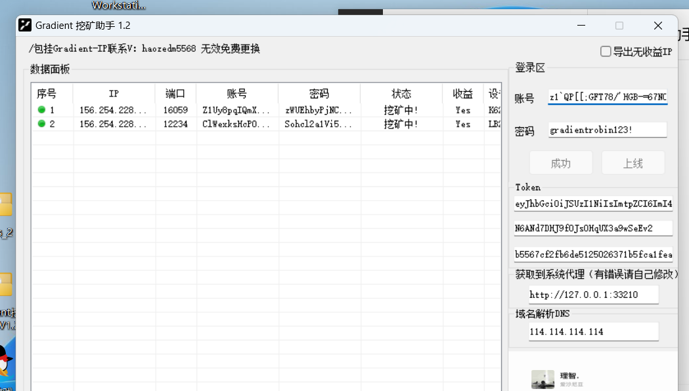

### 审计范围:

​	1.是否有异常流量向非官方地址发送账号密码以及代理ip信息(high)

​	2.指纹掩盖能力是否反女巫(high)

​	3.卡密是否可以破解(low)

##  docker 无头浏览器版本

[来源](https://mirror.xyz/0xc3d4b59Dd687746871dABeBeAF41243F7252b7b8/GBVnzYJqWH_lyQ8LxYDXag85bLJCfQgWzpOxTeqH6co)

还没跑起一直在报各种错误,还在调试,这个是无头浏览器的版本.

### 卡密

### 运行效果

### 审计范围

## 傻XGradient

 [gradient修改重复创建节点bug_傻x.zip](gradient\gradient修改重复创建节点bug_傻x.zip) 

[来源傻Ⅹ的X](https://x.com/lamss001)

[傻X的tg群](https://t.co/VWWwF9cDBx)

### 卡密:

FVOG0P-DCHQS2-7IW7IL-9PPDMO-JJ6B0C-UNQQ58 (两天的试用卡密,价格30u/month)

### 运行效果

运行单IP

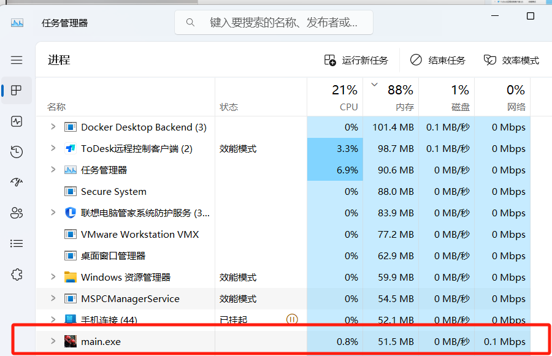

运行两个IP

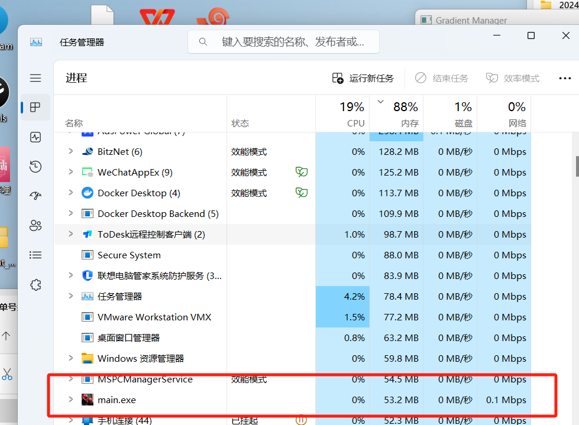

资源占用在多号时没有明显增加

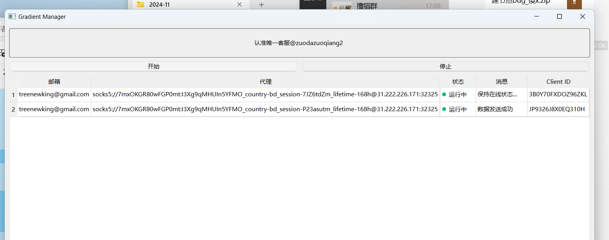

### 审计范围:

​	1.是否有异常流量向非官方地址发送账号密码以及代理ip信息(high)

​	2.指纹掩盖能力是否反女巫(high)

​	3.卡密是否可以破解(low)

# Grass

测试账号

账号:treenewking@gmail.com

密码:Grassrobin123!

## 子清grass

 [grass_2.zip](grass\grass_2.zip) 

[作者推特](https://x.com/qklxsqf)

[代码来源](https://github.com/ziqing888/getgrass-bot)

### 卡密:

无密钥

### 运行效果:

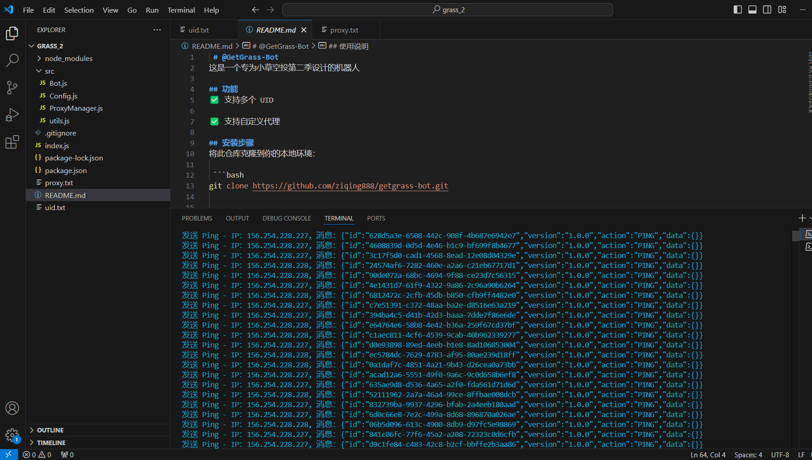

审计范围:

​	 1.是否有异常流量向非官方地址发送账号密码以及代理ip信息(high)

 	2.指纹掩盖能力是否反女巫(high)

### 审计范围:

​	1.是否有异常流量向非官方地址发送账号密码以及代理ip信息(high)

​	2.指纹掩盖能力是否反女巫(high)

​	3.卡密是否可以破解(low)

## 傻XGrass

 [grass2桌面版支持单号多ip_傻x.zip](grass\grass2桌面版支持单号多ip_傻x.zip) 

[来源傻Ⅹ的X](https://x.com/lamss001)

[傻X的tg群](https://t.co/VWWwF9cDBx)

### 卡密:

FVOG0P-DCHQS2-7IW7IL-9PPDMO-JJ6B0C-UNQQ58 (两天的试用卡密,价格30u/month)

### 运行效果

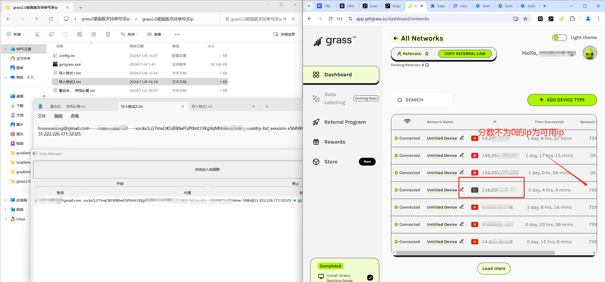

单ip资源使用情况

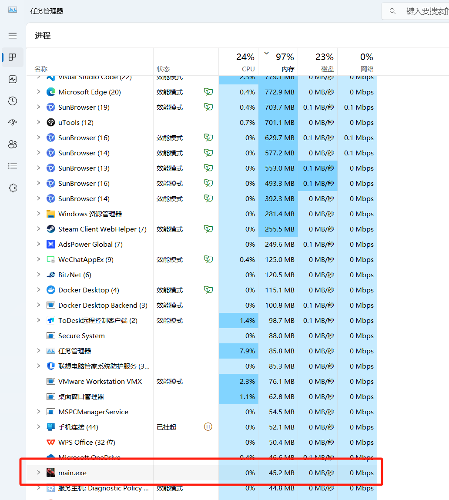

三个ip使用时

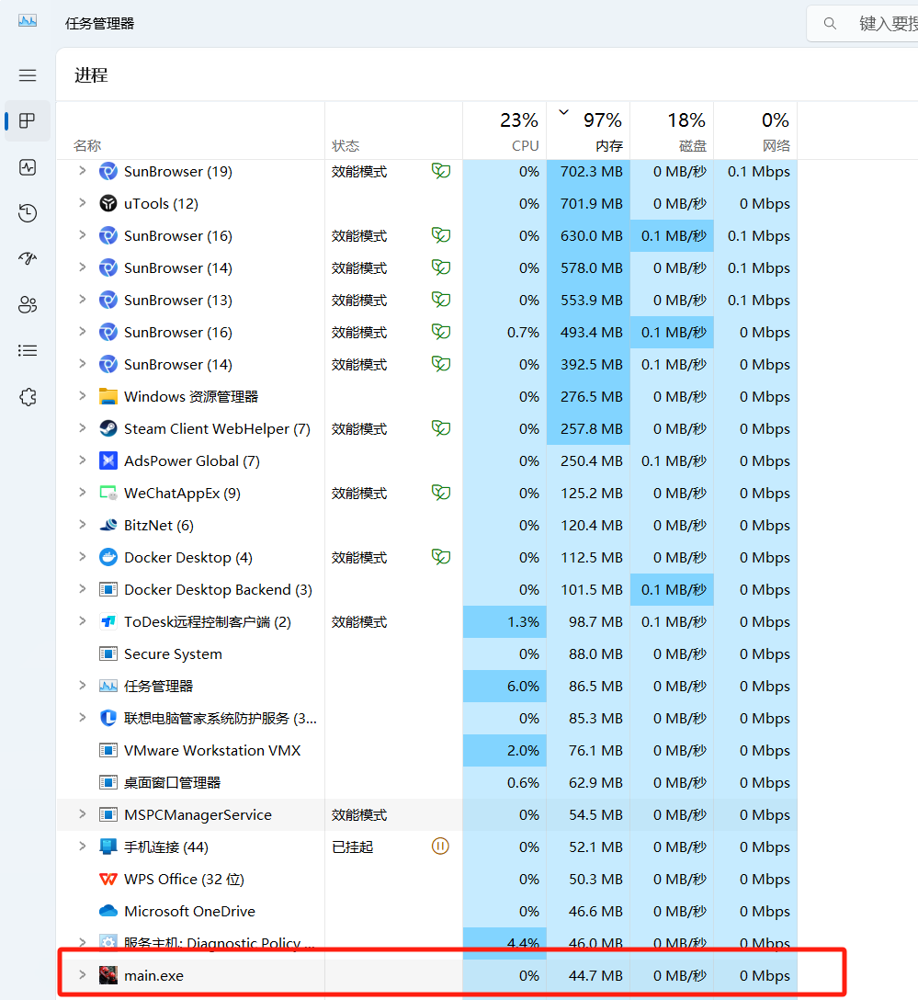

得出结论多ip不会占用新的资源

### 审计范围:

​	1.是否有异常流量向非官方地址发送账号密码以及代理ip信息(high)

​	2.指纹掩盖能力是否反女巫(high)

​	3.卡密是否可以破解(low)

# Dawn

测试账号

账号:treenewking@gmail.com

密码:dawnrobin123!

## 傻XDawn

 [dawn更新登录失败bug.zip](dawn\dawn更新登录失败bug.zip) 

[来源傻Ⅹ的X](https://x.com/lamss001)

[傻X的tg群](https://t.co/VWWwF9cDBx)

### 卡密:

FVOG0P-DCHQS2-7IW7IL-9PPDMO-JJ6B0C-UNQQ58 (两天的试用卡密,价格30u/month)

### 运行效果

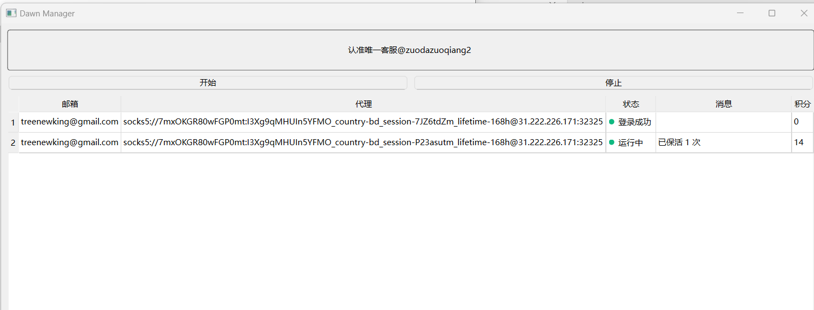

单ip资源占用

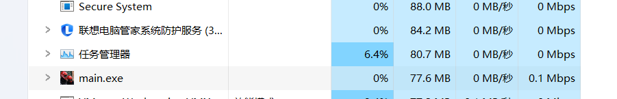

双ip占用

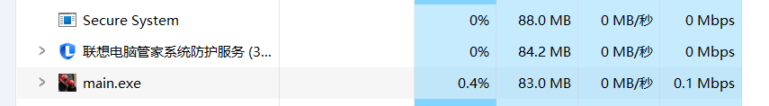

### 审计范围:

​	1.是否有异常流量向非官方地址发送账号密码以及代理ip信息(high)

​	2.指纹掩盖能力是否反女巫(high)

​	3.卡密是否可以破解(low)

# 女巫问题规避

## gradient 规则

[gradient 社区规则](https://docs.gradient.network/sentry-node/community-guidelines)

不支持的ip类型

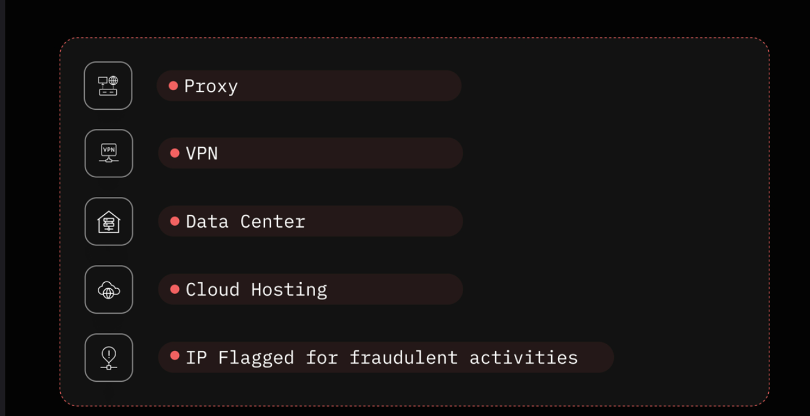

文档中明确提到了会查多号女巫,但是措辞上使用的是削减而不是直接风控.

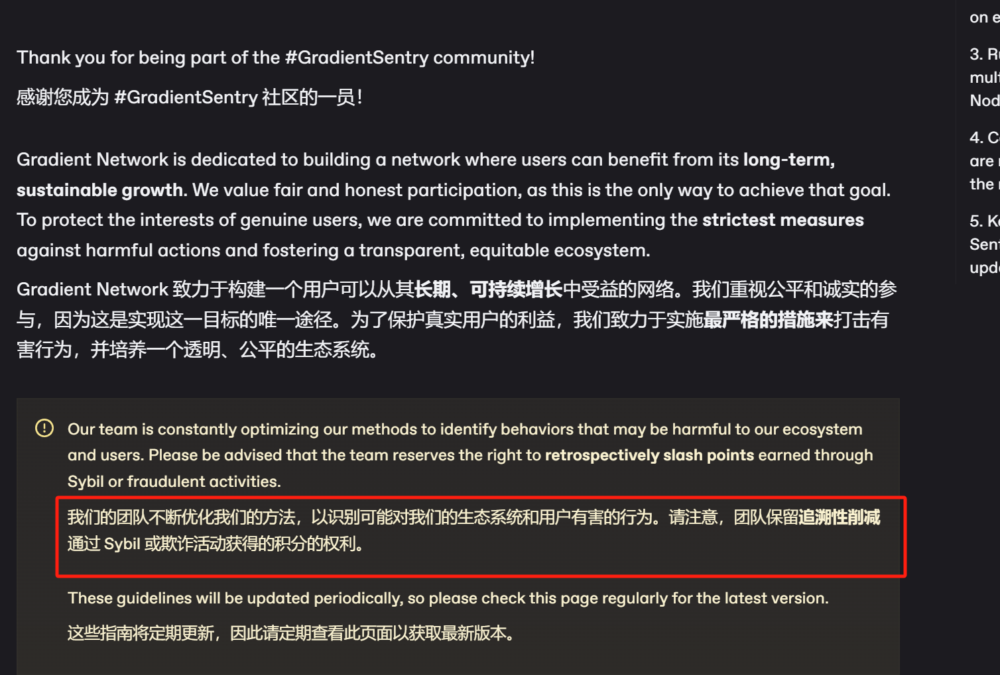

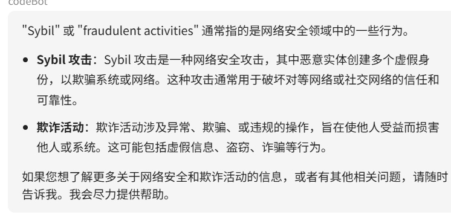

## IP隔离

有几个项目要求住宅IP,为了安全就不要使用机房IP了,不安全,最好选择静态住宅IP,不会被万人骑,否则可能会违反规则,但也有人在用动态住宅Ip去挂项目,这些项目应该都不怎么消耗流量,所以会非常便宜

## 环境隔离

Grass 可以规避女巫的方法

> 单账号+多设备+多IP
>
> 多账号+多设备（只能拿到单IP的奖励）

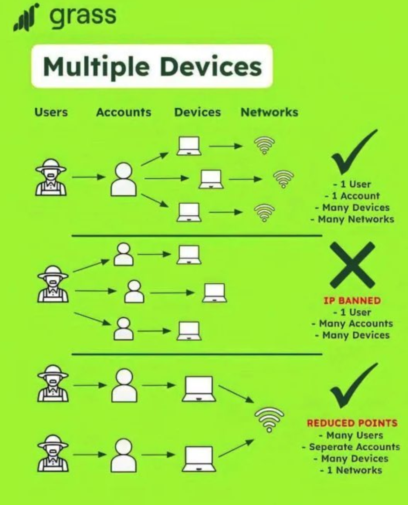

## 邮箱保活

一个邮箱对应一个账号,所以要保证邮箱能够长时间活着,如果邮箱解不了码奖励也就没了

## 总结

1.如果想尽可能的避免女巫的话使用静态住宅IP,然后多使用一点邮箱进行分号,避免一锅被端的情况,动态住宅IP和静态住宅IP的账号如果都要搞的话一定不能一个账号又挂静态,又挂动态.

2.如果想要避免账号的关联性还是不要相互使用推荐码(这个暂时没找到根据)

3.需要通过逆向和抓包了解项目,因为所有的风控都指向了设备,风控的规则是同一设备挂了多ip,在挖矿助手这个gradient方案中是可以提取到设备码的,可以逆向分析一下

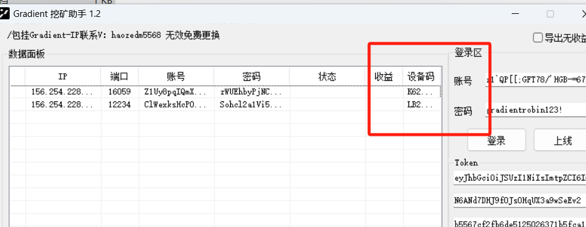

