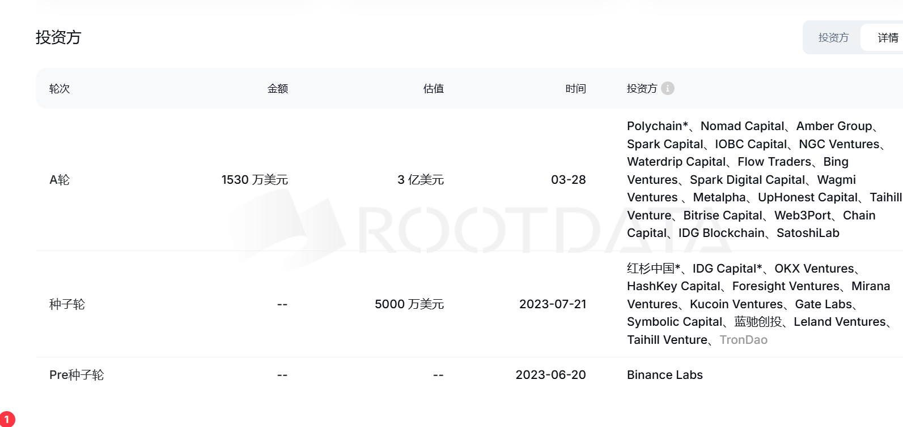
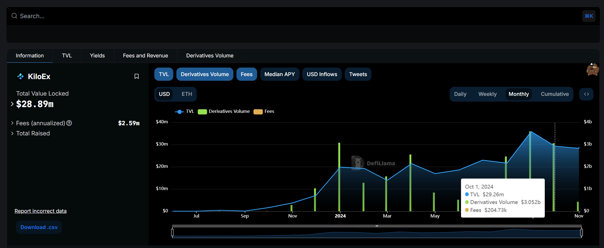
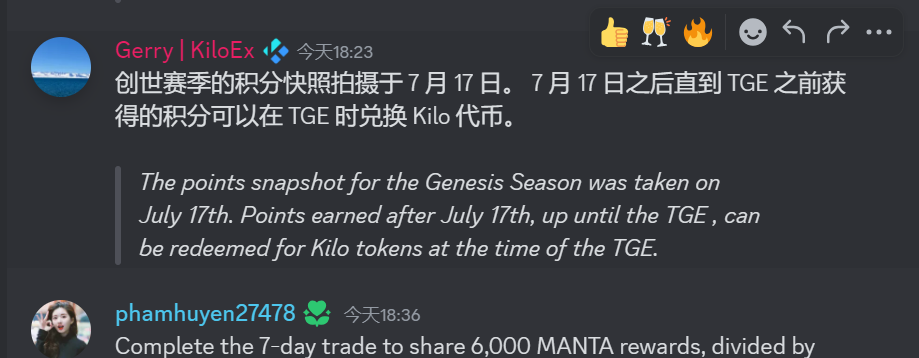
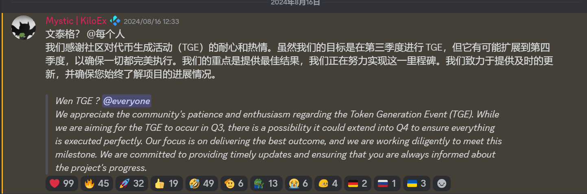
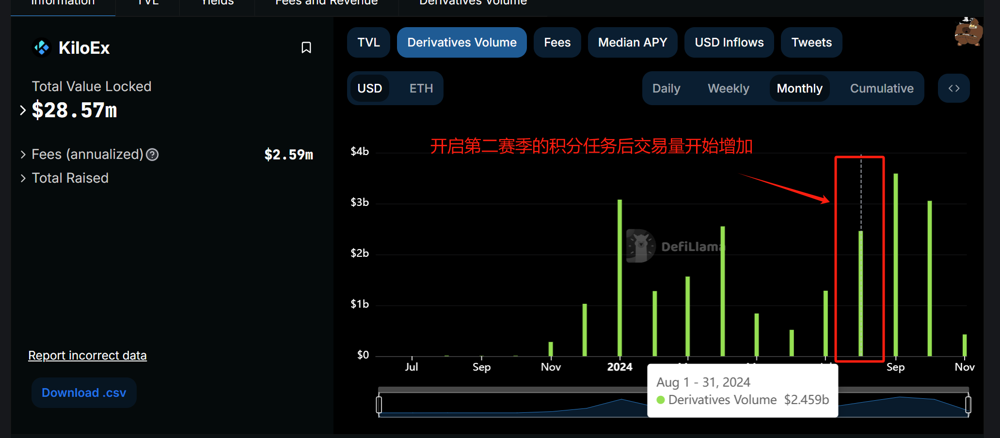

# 项目背景

## dappos

DappOS 是一个用于特定价值任务的意图执行网络，使链和 dApp 能够以意图为中心。它通过创建双边市场将意图转化为链上结果：在供应方，服务提供商抵押抵押品并选择运行一项或多项执行服务。在需求方面，它使开发人员能够找到满足用户意图的解决方案。

融资数据

## kiloex

KiloEx 是一种用户友好的永续合约 DEX，专注于风险管理和资本效率，支持的资产类型包括加密货币、外汇、股票。

TVL:  3000wu

Fee: 250wu(2024/04)=>20wu(2024/10)

交易量: 3b/month (2024/10)

# 积分入口

积分规则,7月17已进行创世赛季的快照.

TGE时间在Q3-Q4	

所以Q3-Q4赛季估计是一个新的积分分发池子

kiloex的积分可以直接在kiloex中刷也可以在dappOs中去刷

## dapp os

第一赛季:转换比 28.57u/1point (交易量) 

第二赛季: 转换比 40.81u/1point（交易量）

Trades conducted after February 1, 2024, 00:00 (UTC): Trading Volume * 0.035 = Points Earned

损耗比例  1500u=>1.5u损耗(获得36point)            0.041u/point

活跃积分=>连续签到七天后每天7分=> 相当于285u的交易额(19%的积分加成)

## kiloex 直刷

